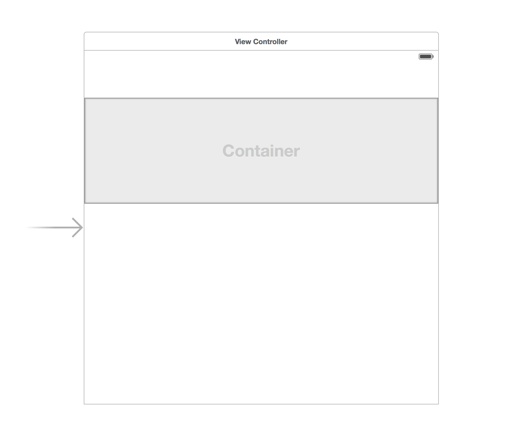
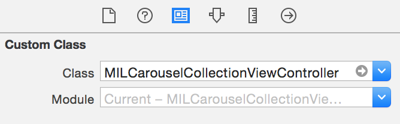
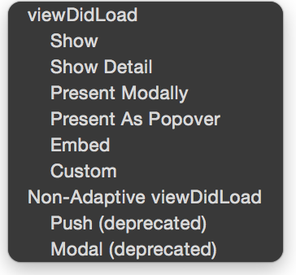
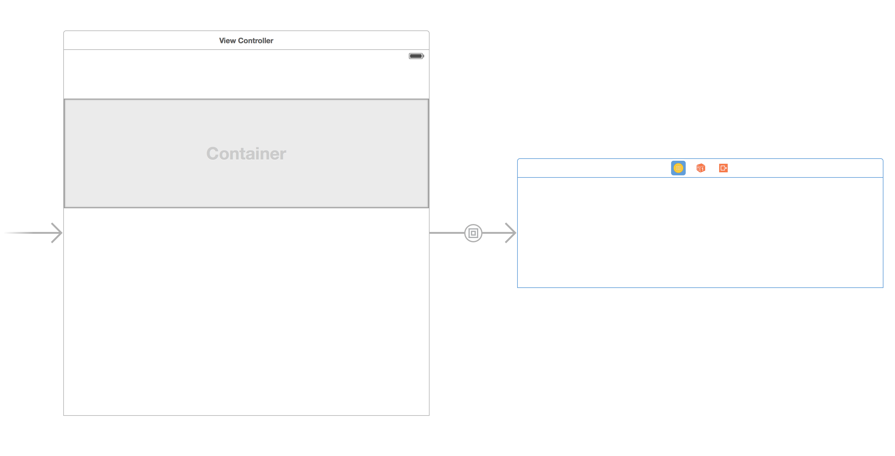
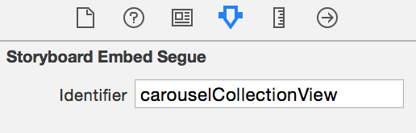

MILCarouselCollectionView
=======================
<br>

<p align="center">
</p>

<br>
MILCarouselCollectionView is an easy to use, drop-in, reusable UI component built in Swift to display collection view cells in a scrollable paged circular carousel. The collection view has the ability to be scrolled by the user or automatically scroll on its own every 4 seconds. As well It can be customized to handle and display any type of data after some minor changes (explained below). By default, the collection view is writen to display images in each cell. MILCarouselCollectionView has the ability to display local images stored in the xcode project as well as has the ability to asynchronously download and cache images from image URLs using its built in functionality or using third party framework [SDWebImage](https://github.com/rs/SDWebImage). In addition, MILCarouselCollectionView also supports displaying placeholder cells while it waits to receive data from a server and resolve a URL to an image.

<br>

## Installation

Simply copy the **`MILCarouselCollectionView`** **folder** into your Xcode project. This folder contains the following 4 files:

1. `MILCarouselCollectionViewController.swift`
1. `MILCarouselCollectionViewFlowLayout.swift`
1. `MILCarouselCollectionViewCell.swift`
1. `MILCarouselCollectionViewCell.xib`

<br>
## Adding MILCarouselCollectionView to a View Controller

For both storyboard and programmatic implementations, you can reference the `ViewController.swift`file in the example xcode project to see an example in context.

<br>
### Programmatic Implementation 

1. In the view controller class file you would like to add a programmatic MILCarouselCollectionViewController to, create a property at the top of the file:

	```swift
	var programmaticCarouselCollectionViewController : MILCarouselCollectionViewController!
```
    
1. To initialize an instance of MILCarouselCollectionViewController programmatically and set it the view controller's `programmaticCarouselCollectionViewController` property we do:

	```swift
	let flow = MILCarouselCollectionViewFlowLayout()
    self.programmaticCarouselCollectionViewController = MILCarouselCollectionViewController(collectionViewLayout: flow)
```    
    
1. To set the frame of the MILCarouselCollectionViewController's view we do:

	```swift
	self.programmaticCarouselCollectionViewController.view.frame = CGRectMake(x: CGFloat, y: CGFloat, width: CGFloat, height: CGFloat)
```
 		
 		
1. To add the MILCarouselCollectionViewController's view to the view controller's view we do:

	```swift
	self.addChildViewController(self.programmaticCarouselCollectionViewController)
   self.programmaticCarouselCollectionViewController.didMoveToParentViewController(self)
    self.view.addSubview(self.programmaticCarouselCollectionViewController.view)
```

<br>
### Storyboard Implementation

1. On the view controller you would like to add the MILCarouselCollectionView to, add a `Container View` to the view controller's view and delete the `UIViewController` storyboard auto embeded in the container view. Add the appropriate autolayout constraints to the container view so that it displays to your liking within the view controller's view. The height and width you make the container view will define the height and width of the MILCarouselCollectionView as well as the height and width of the collection view cells in the MILCarouselCollectionView. Your storyboard should now look like this: <p align="center">
</p>
1. Next add a `UICollectionViewController` to the storyboard. Select this collection view controller on storyboard so that it's highlighted and then select the `Identity Inspector` of the `Utilies` sidebar. Under "Custom Class" make the UICollectionViewController a subclass of `MILCarouselCollectionViewController`<p align="center">
</p>
1. Hold down the control key while you click and drag from the container view on the view controller to the UICollectionViewController (now a MILCarouselCollectionViewController). A dialog box will show asking you what kind of segue you would like to choose, select `Embed`.<p align="center">
</p>Your storyboard should now look like this:<p align="center">
</p>
1. Select the segue arrow that was just added that goes from the Container View to the MILCarouselCollectionViewController. In the `Attributes Inspector` change the `Storyboard Embed Segue Identifier` to  `carouselCollectionView`.<p align="center">
</p>
1. Go to the swift file that represents the UIViewController that has the Container View you added. Create a property at the top of the file 

	```swift
	var storyboardCarouselCollectionView : MILCarouselCollectionViewController!
	```
        
1. Add a prepare for segue method to your view controller if it isn't already added and add the following lines to get the instance of the `MILCarouselCollectionViewController` you added on the storyboard and to save this instance to the view controller's `storyboardCarouselCollectionView` property

	```swift
	override func prepareForSegue(segue: UIStoryboardSegue, sender: AnyObject?) {
 	   if(segue.identifier == "carouselCollectionView"){
 	   		self.storyboardCarouselCollectionView = 
      		segue.destinationViewController as! MILCarouselCollectionViewController
    	}
	}
	```           
        
<br>    
## Usage

###Set Placeholder Cell Image  
    
A placeholder cell is a cell that is displayed in the MILCarouselCollectionView while it waits to be passed data from its parent view controller, this can be useful if there is a delay while retrieving data from a server call. By default, it will display one placeholder cell that it will scroll back and forth to. When the MILCarouselCollectionView finally receieves an array of data, a placeholder image is displayed in each cell of the collection view while we wait for a cell to resolve a url to an image. The following code snippets can be used after you init a MILCarouselCollectionView programmatically, or once you get reference to the storyboard MILCarouselCollectionView in the prepareForSegue method. (Examples shown in the example project)

To set the placeholder item image to a locally stored image within the Xcode project, we pass it the name:

```	swift
self.storyboardCarouselCollectionView.localPlaceHolderImageName = "placeholder_name"
```
	
<br>	
###Passing Data to the MILCarouselCollectionViewController
		
By default, the MILCarouselCollectionViewController expects to handle an array of strings that represent a URL with its built in asychronous image url downloading and caching mechanisms. However, it should be noted that it also supports handling image url strings using the [SDWebImage](https://github.com/rs/SDWebImage) framework. In addition, the MILCarouselCollectionViewController can handle an array of strings that represent names of locally stored images in the Xcode project.  


Chances are when you try to resolve image URL's to images you will get the following warning and you won't be able to download the images:

```
App Transport Security has blocked a cleartext HTTP (http://) resource load since it is insecure. Temporary exceptions can be configured via your app's Info.plist file.
Error: The resource could not be loaded because the App Transport Security policy requires the use of a secure connection.
```

To fix this, go to your `info.plist` file and add the following:

```
<key>NSAppTransportSecurity</key>
<dict>
  <!--Include to allow all connections-->
  <key>NSAllowsArbitraryLoads</key>
      <true/>
</dict>
```

This of course is the lazy way to fix the problem. Eventually you would want to specify which specific web domains you want the app to accept. For more information about this try [this article](http://www.neglectedpotential.com/2015/06/working-with-apples-application-transport-security)

- To pass an array of `image url strings` to the collection view and have the collection view handle this using its **built in asychronous image url downloading and caching** we can do:

	```	swift
	self.carouselCollectionView.setToHandleImageURLStrings()
		    
	let imageURLArray = [String]()
	//populate this array with url strings
		    
	//pass array of strings that represent URLs of images
	self.carouselCollectionView.refresh(imageURLArray)
	
	```
<br>		    
- To pass an array of `image url strings` to the collection view and have the collection view handle this using the **[SDWebImage](https://github.com/rs/SDWebImage)** framework we can do:

	```	swift	
	self.carouselCollectionView.setToHandleImageURLStringsUsingSDWebImage()
	 		
	let imageURLArray = [String]()
	//populate this array with url strings
		    
	//pass array of strings that represent URLs of images
	self.carouselCollectionView.refresh(imageURLArray)
	
	```
	
	Note that in order to use SDWebImage, you must import SDWebImage into your xcode project yourself. As well you will need to uncomment the code in the `setUpCellWithImageURLUsingSDWebImage` method in the `MILCarouselCollectionViewController.swift` file shown below:

	```swift	
private func setUpCellWithImageURLUsingSDWebImage(cell : MILCarouselCollectionViewCell, indexPath : NSIndexPath) -> MILCarouselCollectionViewCell {
        
        
        //Code commented out since SDWebImage isn't imported in the project and to surpress errors and warnings, uncomment to use with sdWebImage
       /* 
        let urlString = self.dataArray[indexPath.row]
        let url = NSURL(string: urlString)
        
        cell.imageView.sd_setImageWithURL(url, placeholderImage: UIImage(named: self.localPlaceHolderImageName))
        */
        
        return cell
    }
```	 
<br>
- To pass an array of `strings that represent locally stored images` to the collection view we can do:

	```swift
	self.carouselCollectionView.setToHandleLocalImageNameStrings()
	 		
	let imageNameArray = [String]()
	//populate this array with locally stored image names
		    
	//pass array of strings that represent names of locally stored images 
	self.carouselCollectionView.refresh(imageNameArray)
	```

<br>
## Customizing MILCarouselCollectionView

###Changing the Height and Width of the Collection View Cells

- The `height` and `width` of a collection view cell changes with respect to the collection view controller's view height and width. 
	- If you are dealing with a programmatic implementation of the MILCarouselCollectionViewController, know that when you set the frame of the collection view controller's view, this will also be the height and width of each cell in the collection view
	- If you are dealing with a storyboard implementation of the MILCarouselCollectionViewController, changing the height and width of the container view that holds the collection view controller will also set the height and width of each cell in the collection view

<br>
###Changing the Autoscroll Timer Duration

By default, the MILCarouselCollectionView autoscrolls to a new cell every 4 seconds. Whenever the user touches the MILCarouselCollectionView, the autoscroll timer is reset.

To change the duration of the autoscroll timer you can do the following after you initialize the MILCarouselCollectionViewController:

```swift
self.carouselCollectionView.setAutoScrollTimerDuration(n)

```

<br>
###Disable Autoscrolling

By default, the MILCarouselCollectionView autoscrolls every 4 seconds to a new cell. 

To disable autoscrolling, do the following after you intialize the MILCarouselCollectionViewController:

```swift
self.carouselCollectionViewController.disableAutoScrolling()
```

<br>
###Disable Circular Scrolling
By default, when the MILCarouselCollectionView is at the last cell in the collection view, if you scroll past this cell, it will scroll back to the first cell in the collection view. 

To disable circular scrolling, do the following after you initialize the MILCarouselCollectionViewController

```swift
self.carouselCollectionViewController.disableCircularScrolling()
```


<br>
###Changing the Kind of Data the Collection View Can Handle

To change the kind of data the collection view can handle, first you will need to modify the dataArray property in the `MILCarouselCollectionViewController.swift` file to be an array of different data types:

```swift
var dataArray : [MyDataObject] = []

```

As well you will need to change the way the collection view controller prepares the cell in the cellForItemAtIndexPath method

```swift
override func collectionView(collectionView: UICollectionView, cellForItemAtIndexPath indexPath: NSIndexPath) -> UICollectionViewCell {

        let cell = collectionView.dequeueReusableCellWithReuseIdentifier("carouselcell", forIndexPath: indexPath) as! MILCarouselCollectionViewCell
        
        //set up cell with a method that sets up the cell with a custom data object
        return self.setUpCellWithCustomDataObject(cell, indexPath: indexPath)

    }
```

<br>
###Changing the Collection View Cell's UI

To change the UI of the collection view cell, you can do this by modifying the `MILCarouselCollectionViewCell.xib` file. By default, the collection view cell only has an image view that stretches accross the whole cell. Of course, with modifying the collection view cell's UI, comes changing the way we prepare and set up the data in the cell using the cellForItemAtIndexPath method.

<br>
## Requirements
* MILCarouselCollectionView has only been tested to work with iOS 9+ and Xcode 7.1.1

## Author

Created by [Alex Buck](https://www.linkedin.com/in/alexanderbuck)
 at the [IBM Mobile Innovation Lab](http://www-969.ibm.com/innovation/milab/)

## License

MILCarouselCollectionView is available under the Apache 2.0 license. See the LICENSE file for more info.

## Sample App License
The MILCarouselCollectionViewExample sample application is available under the Apple SDK Sample Code License. Details in the file called `SAMPLE_APP_LICENSE` under the Example directory.
